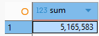
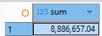
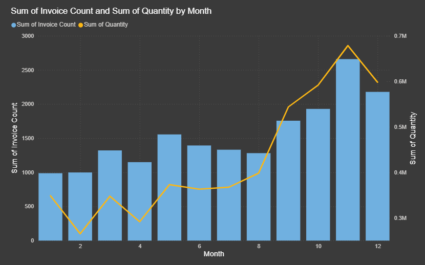
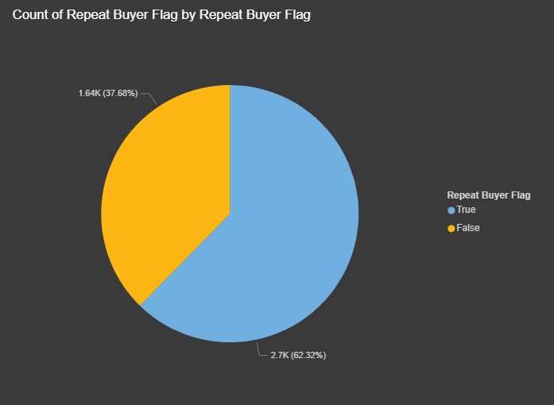
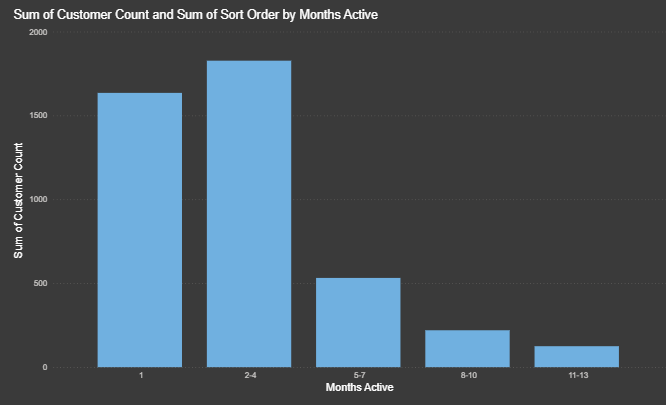
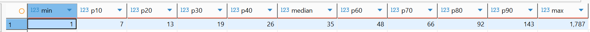
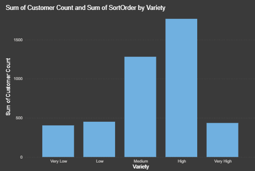
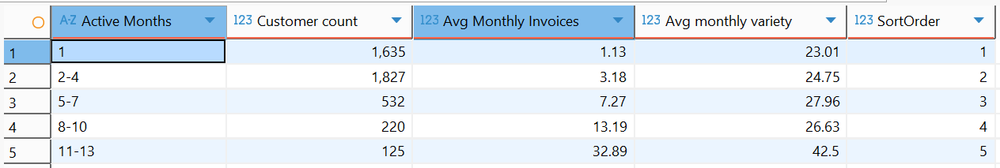

- Total sales overview
	- Total amount of products sold
		- 
	- Income Gained from sold products
		- 
	- 5,165,583 products were sold which amount to 8,886,657.04 of revenue.
- When do customers buy from the store?
	- 
	- The first 8 months of the year was steady, it had little differences in the amount of invoices. The noticeable spikes were only found in March and May, the month after these two always saw a dip and then that will be maintained until August. The 'ber' months see an in increase in invoice count, to contextualize this, these months make up 46% of the total invoices and 47% of the quantity of products sold.
	- This suggests demand is relatively stable for most of the year, with a strong seasonal uplift toward the end of the year, making the ‘ber’ months a critical period for sales volume.
- What is the ratio of one-time buyers vs repeat buyers?
	- 
	- 
	- 
	- 62% of customers are repeat buyers, majority of these repeat buyers purchasing products for 2 to 4 months of the year, making up 42% of the total repeat buyers.
	- This indicates that repeat buyers mostly return for a short period of time, while only less than 22% are active for more than half the year.
- What is the variety of customer purchases?
	- Customers' distinct Stockcode purchase
		- Percentiles
			- 
	- Amount of Customers by Purchase Variety
		- 
		- The bar graph above categorizes the variety of products that customers purchase: very low, low, medium, high, and very high. Among these categories, customers fall most in the high and then medium next. This shows that most customers purchase a wide array of products from the store.
- What is the variety of customer purchases by the Number of Active Months?
	- Purchase Variety for Repeat Buyers
		- 
		- The table above shows the amount of customers per engagement level or number of months active and the average monthly variety of products that they purchase.
		- Among the repeat buyers, the most active customers were the most diverse in their product purchases despite being the least in customer count.
		- The least active customers, the one-time buyers placed 4th, higher than only the 2-4 month active customers in terms of their monthly average product variety.
		- While long-term customers higher monthly invoices but not product purchasing variety. Mid- to long-term customers show mixed purchasing patterns, whereas the most active customers demonstrate the highest average monthly product variety.
- Conclusion
	- There is a strong seasonal trend, with customers purchase on the tail-end of the year, during the 'Ber' months.
	- The majority of the customers are repeat buyers, taking up 62% of the total customer base. Among these, roughly 42% are active for 2-4 months, while 22% are active for 5-13 months.
	- In terms of raw number of products purchased, most customers fall under the medium to high variety of purchases.
	- Customer engagement has a linear relationship with average monthly invoices, but showing varied results for the variety of product they purchase.
