- Dataset Reference
	- Dataset link:
	  https://www.kaggle.com/datasets/ulrikthygepedersen/online-retail-dataset?resource=download
- Dataset Overview
	- The dataset contains 541,909 rows and 8 columns.
	- The dataset's columns are:
		- InvoiceNo
			- Invoice number. Nominal, a 6-digit integral number uniquely assigned to each transaction. If this code starts with letter 'c', it indicates a cancellation.
		- stockcode
			- Product (item) code. Nominal, a 5-digit integral number uniquely assigned to each distinct product.
		- Description
			- Product (item) name
		- Quantity
			- The quantities of each product (item) per transaction
		- InvoiceDate
			- Invice Date and time. Numeric, the day and time when each transaction was generated.
		- UnitPrice
			- Product price per unit in sterling.
		- CustomerID
			- Customer number. Nominal, a 5-digit integral number uniquely assigned to each customer.
		- country
	- The dataset contains retail between 12/01/2010 and 12/07/2011.
- Categorical Distribution
	- Invoiceno
		- 
	- stockcode
		- 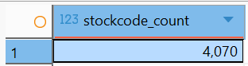
	- CustomerID
		- 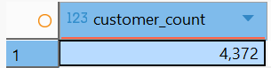
	- Country
		- 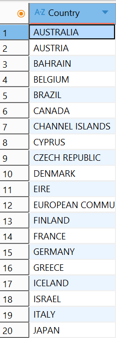
		  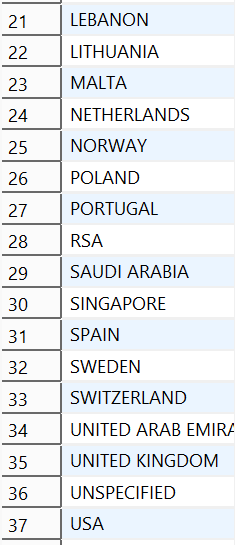
		- There are 36 categorized countries with one unspecified category.
- Data Integrity & Consistency Checks
	- Note:
		- Every bullet under data checks were paired with the execution of respective cleaning sections in the online_retail_cleaning document. So every successive step done in this process is working with the dataset that is undergoing cleaning. So the invalid values check made use of the dataset without null values while the duplicates made is used on the dataset without the invalid values.
	- Data types
		- Invoiceno has a target type of INT.
		- InvoiceDate is of type VARCHAR.
	- Null values
		- 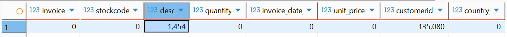
	- Invalid values
		- 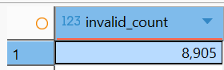
		- 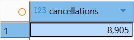
		- All cancelled transactions have a negative quantity; only quantity had invalid values, all values under UnitPrice were above 0. All other transactions have proper values
	- Distribution Overview
		- quantity
			- 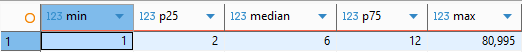
		- unitprice
			- 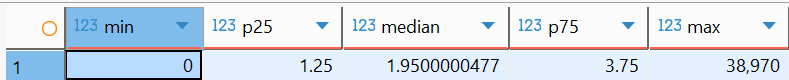
	- Duplicates
		- The key columns for determining duplicates are InvoiceNo, InvoiceDate, Stockcode, UnitPrice, Quantity, and CustomerID.
		- Number of distinct transactions
			- 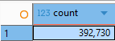
		- Number of transactions with duplicates
			- 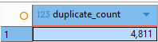
